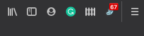
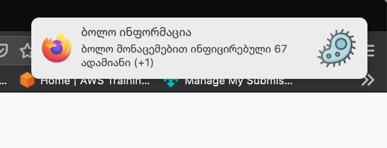

#StopCov.ge ის დადასტურებული შემთხვევების მონიტორინგის AddOn FireFox ისთვის




### ინსტალაცია


```
git clone https://github.com/nikopeikrishvili/StopCov-Tracker-Moz.git
```

Firefox ის ახალ ფანჯარაში ჩაწერეთ :
```
about:debugging#/runtime/this-firefox
```

დააჭირეთ ღილაკს 
```
Load Temporary AddOn...
```

და მიუთითეთ გაიხსნი ფანჯარაში აირჩიეთ ფოლდერი რომელშიც მოხდა git clone და აირჩიეთ ფაილი stopcov.js


